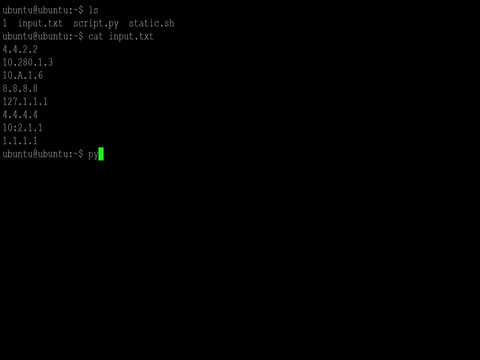

# Logicalis - Hackathon 2022

[Home](../README.md) - [Next](P2.md)

  

# Posta 1 - Validación y manejo de direcciones IP
## Objetivo
En esta posta debemos escribir un código en python para validar y/o verificar la conectividad **(PING)** de un [listado de direcciones IP](Direcciones.txt).

- El script debe reccorrer un **listado de direcciones IP** y poder manejar las distintas excepciones.

- Notificando que tipo de excepción es (si la hay) sin detenerse en ningun momento.

- El **listado de direcciones IP** debe ser tomado como un argumento. **(VER GIF)** 

  

> El directorio $HOME/output/ es necesario para esta y las otras, lo vamos a generar con el siguiente comando:
> ~~~bash
> mkdir $HOME/output
> ~~~

## Contexto
Se les dispondrá de un archivo **.txt** condistintas **direcciones IP**, a las cuales deberan hacer una **prueba de conectividad** y notificar si fue valida o si hubo alguna excepción (notificar que tipo de excepcion).

## Validación
Se debe obtener un resultado similar al del ejemplo **(GIF)** provisto.

[Home](../README.md) - [Next](P2.md)
