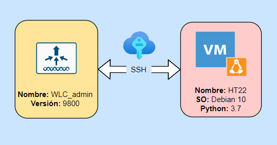

# Logicalis - Hackathon

[Back](P2.md) - [Home](../README.md)

  

# Posta 3 - Creación de usuario
## Objetivo
Para esta posta debemos escribir un código en python 'posta_3.py' que agregue un usuario al **WLC** (especificar comando a usar) y guardar el resultado que devuelve el comando '(comando para ver los usuarios dentro del **WLC**)' en un archivo 'output/posta_3.txt'.

> Comando para generar un usuario nuevo:
> ~~~bash
> username cisco privilege 15 secret 0 cisco
> ~~~

## Contexto
Nos interesa enviar algun comando dentro del **WLC** para validar nuestra presencia dentro de el.

## Validación
Guardar el resultado que devuelve el comando '(comando para ver los usuarios dentro del **WLC**)' en un archivo 'output/posta_3.txt' dentro de **HT22**.

[Back](P2.md) - [Home](../README.md)
